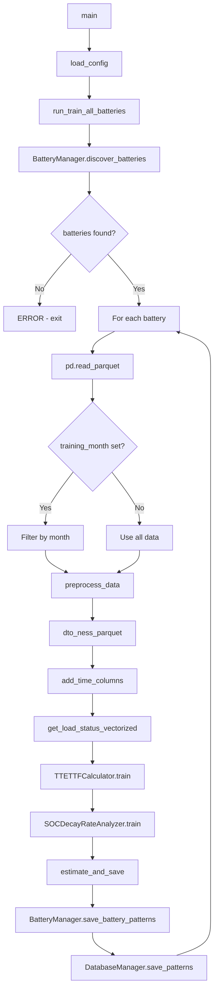
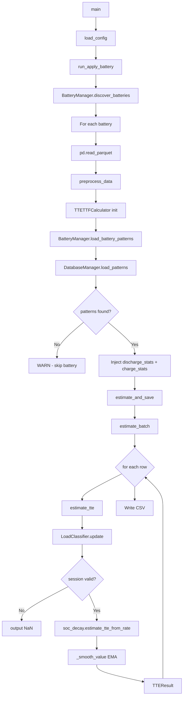
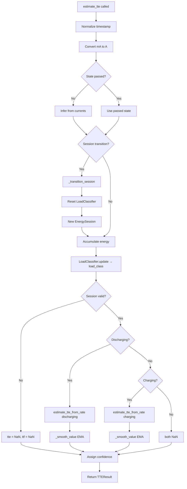

# TTE/TTF Battery Analytics System — Technical Documentation

> Auto-generated documentation for the Time To Empty / Time To Full estimation pipeline
> Generated on: 2026-04-01

---

## 1. System Overview

This system estimates **Time To Empty (TTE)** and **Time To Full (TTF)** for NESS battery packs using data-driven, historically-grounded SOC decay rate analysis. It processes raw telemetry data (current, voltage, SOC) from battery management systems (BMS), learns per-battery discharge and charge behavior, and produces stable per-sample TTE/TTF predictions at scale.

### Key Design Principles

- **Empirical, not reactive**: TTE is not computed from instantaneous current. It is computed from historically observed SOC decay rates calibrated to the current operating point (SOC level × load type × current magnitude).
- **Stable, not jumpy**: Exponential smoothing and session validation gates prevent erratic output during noisy operating conditions.
- **Per-battery learning**: Each battery ID has its own trained pattern set stored in SQLite — there is no shared global model that would average away individual battery characteristics.
- **Scale-first storage**: All trained patterns live in a single `battery_patterns.db` SQLite file regardless of fleet size. No per-battery `.pkl` file management.

---

## 2. Why Naive Estimations Fail

### The Naive Approach
```
TTE = battery_capacity_Ah / current_A
```

This fails because:

| Failure Mode | Cause | Impact |
|---|---|---|
| **Dynamic load fluctuation** | Current changes second-to-second | TTE jumps ±30 min on minor load changes |
| **SOC non-linearity** | Battery chemistry is not linear — 90→80% SOC ≠ 50→40% SOC | Systematic over/underestimation at extremes |
| **Load pattern blindness** | A cyclic 2A load drains faster than a steady 2A load due to heat and chemistry | Same current → different actual drain rate |
| **Coulomb counting drift** | Integrating current introduces cumulative error | TTE diverges over long sessions |
| **Sensor noise** | BMS current readings have ±10-50 mA noise floor | Causes rest/charging/discharging misclassification |

### This System's Approach
Instead of computing TTE from instantaneous current, the system:
1. Learns historical SOC decay rates for 800 possible operating cells `(soc_window × load_class × current_range × phase)`
2. At runtime, identifies the current operating cell and looks up the observed decay rate
3. Applies `TTE = SOC / decay_rate` with smoothing

This means the estimate is grounded in how *this specific battery actually behaved* in the past, not a theoretical formula.

---

## 3. System Architecture

```
┌──────────────────────────────────────────────────────────────────┐
│  DATA LAYER                                                       │
│  data/<battery_id>.parquet  (raw BMS telemetry, one file/battery)│
└─────────────────────────────┬────────────────────────────────────┘
                              ↓
┌──────────────────────────────────────────────────────────────────┐
│  INGESTION & PREPROCESSING  (src/main.py)                        │
│  dto_ness_parquet → add_time_columns → state detection           │
│  Output: Normalized DataFrame with state, current_a, soc, ts    │
└─────────────────────────────┬────────────────────────────────────┘
                              ↓
┌──────────────────────────────────────────────────────────────────┐
│  FEATURE ENGINEERING  (src/tte_ttf_algorithm.py)                 │
│  LoadClassifier: idle / steady / cyclic / transient              │
│  SOC window bucketing: 0, 5, 10, ..., 95                         │
│  Current range binning: low / medium / high / very_high          │
└─────────────────────────────┬────────────────────────────────────┘
                              ↓
┌──────────────────────────────────────────────────────────────────┐
│  TRAINING  (SOCDecayRateAnalyzer.train)                          │
│  Rolling 5-min windows → observed decay rates                    │
│  Grouped by (soc_window, load_class, current_range, phase)       │
│  Statistics: mean, median, std, count per cell                   │
└─────────────────────────────┬────────────────────────────────────┘
                              ↓
┌──────────────────────────────────────────────────────────────────┐
│  PATTERN STORAGE  (src/db.py + src/battery_manager.py)           │
│  SQLite: battery_patterns + battery_metadata tables              │
│  Single database file for entire fleet                           │
└─────────────────────────────┬────────────────────────────────────┘
                              ↓
┌──────────────────────────────────────────────────────────────────┐
│  INFERENCE  (SimpleTTECalculator.estimate_tte)                   │
│  Load patterns from DB → rebuild dicts in memory                 │
│  Per-sample: classify load → lookup decay rate → TTE = SOC/rate  │
│  Smoothing → session validation → confidence scoring             │
└─────────────────────────────┬────────────────────────────────────┘
                              ↓
┌──────────────────────────────────────────────────────────────────┐
│  OUTPUT  (output/<battery_id>.csv)                               │
│  timestamp, soc, voltage_v, current_a, status,                  │
│  tte_hours, ttf_hours, confidence, time_hhmmss                   │
└──────────────────────────────────────────────────────────────────┘
```

---

## 4. Data Schema

### 4.1 Raw Input (Parquet)

One `.parquet` file per battery in `data/` folder.

| Column | Type | Unit | Description |
|---|---|---|---|
| `timestamp` | int64 | ms (Unix epoch) | BMS measurement timestamp |
| `Ip` | float | mA | Pack current — positive = discharging, negative = charging |
| `Vp` | float | mV | Pack voltage |
| `SoC` | float | % | State of Charge |
| `FullCap` | float | raw units | Full charge capacity — divide by 1000 for Ah |
| `BT1`–`BT4` | float | raw units | Battery temperatures — divide by 10 for °C |
| `V1`–`V16` | float | mV | Individual string voltages |
| `SoH` | float | % | State of Health |
| `CyCnt` | float | count | Charge cycle count |

### 4.2 Preprocessed (Post-DTO)

After `dto_ness_parquet` and `preprocess_data()`:

| Column | Type | Description |
|---|---|---|
| `ts` | int64 | Original Unix ms timestamp |
| `utc_time` | datetime64[ns, UTC] | Converted UTC datetime |
| `diff_time_secs` | int32 | Seconds since previous sample |
| `ic` | float | Charge current magnitude (mA) |
| `id` | float | Discharge current magnitude (mA) |
| `lv` | float | Pack voltage (mV) |
| `soc` | float | State of Charge (%) |
| `tmp` | float | Max battery temperature (°C) |
| `FullCap` | float | Full capacity (raw units, /1000 = Ah) |
| `pack_current_net` | float | Net current: ic − id (mA) |
| `state` | str | `charging` / `discharging` / `rest` |
| `current_a` | float | Absolute current magnitude (A) |

### 4.3 Output CSV

Written to `output/<battery_id>.csv` or `output/<battery_id>_applied.csv`:

| Column | Type | Description |
|---|---|---|
| `timestamp` | ISO datetime | UTC timestamp |
| `soc` | float | State of Charge (%) |
| `voltage_v` | float | Pack voltage (raw mV) |
| `current_a` | float | Effective current magnitude (A) |
| `status` | str | `charging` / `discharging` / `rest` |
| `tte_hours` | float or null | Time To Empty in hours (null if not applicable or session not validated) |
| `ttf_hours` | float or null | Time To Full in hours (null if not applicable or session not validated) |
| `confidence` | str | `high` / `medium` / `low` |
| `time_hhmmss` | str | Formatted estimate (e.g., `01:23:45`) or `infinite` |
| `num_samples` | int | Always 1 in batch mode |

### 4.4 Database Schema (SQLite)

**`battery_patterns` table**

| Column | Type | Primary Key | Description |
|---|---|---|---|
| `battery_id` | TEXT | Yes | Battery identifier (e.g., SE0100000092) |
| `label` | TEXT | Yes | Training version tag (e.g., september_2025) |
| `phase` | TEXT | Yes | `discharge` or `charge` |
| `soc_window` | INTEGER | Yes | SOC bracket: 0, 5, 10, ..., 95 |
| `load_class` | TEXT | Yes | `idle`, `steady`, `cyclic`, `transient`, `unknown` |
| `current_range` | TEXT | Yes | `low`, `medium`, `high`, `very_high` |
| `rate_mean` | REAL | — | Mean decay rate (%/min) |
| `rate_std` | REAL | — | Standard deviation of decay rate |
| `rate_median` | REAL | — | Median decay rate (outlier-resistant) |
| `count` | INTEGER | — | Observations contributing to this cell |

**`battery_metadata` table**

| Column | Type | Primary Key | Description |
|---|---|---|---|
| `battery_id` | TEXT | Yes | Battery identifier |
| `label` | TEXT | Yes | Training version tag |
| `session_min_duration_minutes` | REAL | — | Minimum session duration gate |
| `session_min_energy_ah` | REAL | — | Minimum energy change gate |
| `tte_ttf_smoothing_factor` | REAL | — | EMA alpha for output smoothing |
| `trained_at` | TIMESTAMP | — | Training run datetime |

---

## 5. Module Reference

### 5.1 `src/main.py` — Pipeline Entry Point

**Purpose**: Orchestrates end-to-end pipeline. Loads config, discovers batteries, drives preprocessing, training, inference, and storage.

---

#### `load_config() → dict`

| Aspect | Detail |
|---|---|
| **Purpose** | Reads `config.yaml` from project root |
| **Returns** | Parsed YAML as Python dict |
| **Raises** | `FileNotFoundError` if config.yaml missing |
| **Called By** | `main()` |

---

#### `get_load_status_vectorized(current_series: pd.Series) → pd.Series`

| Aspect | Detail |
|---|---|
| **Purpose** | Classify entire current column into states using numpy vectorized ops |
| **Parameters** | `current_series` — net pack current in mA (float) |
| **Returns** | String Series: `charging` / `discharging` / `rest` |
| **Logic** | `>+50 mA` = charging; `<-50 mA` = discharging; else rest |
| **Performance** | Processes 1M rows in <1ms vs 16s with `.apply()` |
| **Called By** | `preprocess_data()` |

Thresholds:
```
charging:     pack_current_net > +50 mA
discharging:  pack_current_net < -50 mA
rest:         -50 mA ≤ pack_current_net ≤ +50 mA
```
The 50 mA noise floor prevents BMS sensor noise from creating spurious state transitions.

---

#### `add_time_columns(data_df: pd.DataFrame) → pd.DataFrame`

| Aspect | Detail |
|---|---|
| **Purpose** | Add `utc_time` and `diff_time_secs` to DataFrame |
| **Parameters** | `data_df` — DataFrame with `ts` column (Unix ms) |
| **Returns** | DataFrame sorted by `ts`, with `utc_time` (datetime64 UTC) and `diff_time_secs` (int32) added |
| **Called By** | `preprocess_data()` |

---

#### `preprocess_data(df: pd.DataFrame) → pd.DataFrame`

| Aspect | Detail |
|---|---|
| **Purpose** | Full preprocessing: DTO transform → time columns → state detection |
| **Parameters** | `df` — raw parquet DataFrame |
| **Returns** | Algorithm-ready DataFrame |
| **Calls** | `dto_ness_parquet()`, `add_time_columns()`, `get_load_status_vectorized()` |
| **Called By** | `run_train_all_batteries()`, `run_apply_battery()` |

Steps:
1. Apply `dto_ness_parquet()` — converts raw BMS columns to `ic`, `id`, `lv`, `soc`, `tmp` etc.
2. Sort by `ts`, add `utc_time` and `diff_time_secs`
3. Compute `pack_current_net = ic − id`
4. Classify states vectorized: `state = get_load_status_vectorized(pack_current_net)`
5. Add `current_a = abs(pack_current_net)`

---

#### `estimate_and_save(calculator, data_df, config, output_file, label) → pd.DataFrame`

| Aspect | Detail |
|---|---|
| **Purpose** | Run `estimate_batch()` on preprocessed data and save CSV |
| **Parameters** | `calculator` — trained TTETTFCalculator; `data_df` — preprocessed; `output_file` — path to output CSV |
| **Returns** | Results DataFrame |
| **Side Effects** | Writes CSV to `output_file`. Prints coverage and sample stats. |
| **Called By** | `run_train_all_batteries()`, `run_apply_battery()` |

---

#### `run_train_all_batteries(config, project_root)`

| Aspect | Detail |
|---|---|
| **Purpose** | Discover all `.parquet` files → train one `TTETTFCalculator` per battery → save patterns to SQLite |
| **Parameters** | `config` — loaded YAML dict; `project_root` — base Path |
| **Side Effects** | Writes `output/<battery_id>.csv` and inserts rows to `battery_patterns.db` for each battery |
| **Called By** | `main()` when `mode = train_all_batteries` |

Flow:
```
1. BatteryManager.discover_batteries()
2. For each battery:
   a. pd.read_parquet()
   b. Optional month filter (training_month config)
   c. preprocess_data()
   d. TTETTFCalculator.train()
   e. estimate_and_save()
   f. BatteryManager.save_battery_patterns()
```

---

#### `run_apply_battery(config, project_root)`

| Aspect | Detail |
|---|---|
| **Purpose** | Discover all batteries → load trained patterns from DB → run inference only |
| **Parameters** | `config` — loaded YAML dict; `project_root` — base Path |
| **Side Effects** | Writes `output/<battery_id>_applied.csv` for each battery with loaded patterns |
| **Called By** | `main()` when `mode = apply_battery` |
| **Skips** | Any battery where patterns are not found in DB (logs `[WARN]`) |

---

#### `main()`

| Aspect | Detail |
|---|---|
| **Purpose** | Entry point — reads config mode and dispatches to correct runner |
| **Modes** | `train_all_batteries` → `run_train_all_batteries()`; `apply_battery` → `run_apply_battery()` |
| **Raises** | `ValueError` for unknown mode |

---

### 5.2 `src/tte_ttf_algorithm.py` — Core Algorithm

---

#### Class: `LoadClassifier`

**Purpose**: Classifies the current load pattern into one of five categories using a rolling window of current magnitude observations.

```python
LoadClassifier(window_samples: int = 30)
```

**State**: `current_history` — deque of last 30 absolute current readings (A).

---

##### `LoadClassifier.update(current_a: float) → str`

| Aspect | Detail |
|---|---|
| **Purpose** | Add one current sample to history and return current load class |
| **Parameters** | `current_a` — current in Amperes (absolute value used internally) |
| **Returns** | `idle`, `steady`, `cyclic`, `transient`, or `unknown` |
| **Returns `unknown`** | If `current_a` is NaN or fewer than 5 samples in history |

Classification logic:
```
cv = current_std / (current_mean + 0.001)   # coefficient of variation, +epsilon avoids /0

current_mean < 0.1 A   → 'idle'        (negligible load)
cv < 0.15              → 'steady'      (stable current, e.g. constant discharge)
cv > 0.50              → 'transient'   (wildly varying, e.g. acceleration spike)
else                   → 'cyclic'      (moderate variation, e.g. periodic on/off)
```

---

##### `LoadClassifier.reset()`

Clears the rolling history. Called on every session boundary transition.

---

#### Class: `SOCDecayRateAnalyzer`

**Purpose**: Learns historical SOC decay rates during training. At inference, provides a decay rate lookup for any `(soc_window, load_class, current_range, phase)` combination.

```python
SOCDecayRateAnalyzer(soc_step: int = 5, current_bins: int = 5)
```

**Key attributes after training:**
- `discharge_stats`: `dict[(soc_window, load_class, current_range)] → {rate_mean, rate_std, rate_median, count}`
- `charge_stats`: same structure for charging phase
- `is_trained`: `bool`

---

##### `SOCDecayRateAnalyzer.train(data_df, soc_col, current_col, voltage_col, status_col, timestamp_col, window_minutes=5.0)`

| Aspect | Detail |
|---|---|
| **Purpose** | Scan all charge/discharge sessions and learn SOC decay rates per operating cell |
| **Parameters** | `data_df` — preprocessed DataFrame with state, soc, current_a, ts columns; `window_minutes` — rolling window size (default 5 min) |
| **Side Effects** | Populates `discharge_stats`, `charge_stats`, sets `is_trained=True` |

**Algorithm (rolling window method):**

```
For each session (contiguous block of same state):
  For each row i as window start:
    Find row j where ts[j] ≈ ts[i] + window_minutes

    soc_delta = soc[j] - soc[i]
    time_delta_min = (ts[j] - ts[i]) / 60

    decay_rate = |soc_delta| / time_delta_min   (% per minute)

    Apply filters:
    - time_delta_min < 0.5 → skip (too short)
    - |soc_delta| < 0.01   → skip (no meaningful change)
    - decay_rate > 0.5     → skip (outlier / sensor glitch)

    Compute:
    - soc_window = floor(soc[i] / 5) * 5
    - current_range = _get_current_range_key(mean current in window)
    - load_class = load_class at window start (unknown → steady)

    For discharging sessions with soc_delta < 0:
      discharge_data[(soc_window, load_class, current_range)].append(decay_rate)

    For charging sessions with soc_delta > 0:
      charge_data[(soc_window, load_class, current_range)].append(decay_rate)

For each cell with >= 2 observations:
  discharge_stats[key] = {
    rate_median: median(rates),
    rate_mean:   mean(rates),
    rate_std:    std(rates),
    count:       len(rates)
  }
```

**Why rolling windows, not sample-to-sample?**

Sample-to-sample transitions are extremely noisy — a single BMS polling artifact can show a 5% SOC jump in 18 seconds. Rolling 5-minute windows smooth out noise and capture true chemistry-level behavior.

---

##### `SOCDecayRateAnalyzer.estimate_tte_from_rate(current_soc, current_a, load_class, state) → Optional[float]`

| Aspect | Detail |
|---|---|
| **Purpose** | Look up decay rate for current operating cell and compute TTE/TTF |
| **Parameters** | `current_soc` — current SOC (%); `current_a` — current (A); `load_class` — from LoadClassifier; `state` — `discharging` or `charging` |
| **Returns** | Estimated hours (float) or `None` if no lookup succeeds or result invalid |
| **Cap** | Returns 24.0 if computed value exceeds 24 hours |

**Lookup with 3-tier fallback:**
```
1. Exact match: (soc_window, load_class, current_range)
2. Same SOC + load class, average all current ranges
3. Same load class only, average all SOC windows
4. Any pattern in this phase — average everything
5. None found → return None
```

**TTE/TTF formula:**
```python
# Discharging:
remaining_soc = current_soc          # assume min_soc = 0%
tte_minutes   = remaining_soc / decay_rate
tte_hours     = tte_minutes / 60

# Charging:
remaining_soc = 100 - current_soc    # assume max_soc = 100%
ttf_minutes   = remaining_soc / decay_rate
ttf_hours     = ttf_minutes / 60
```

---

##### `SOCDecayRateAnalyzer._get_current_range_key(current_a: float) → str`

| Range | Condition |
|---|---|
| `low` | `current_a < 0.5 A` |
| `medium` | `0.5 ≤ current_a < 2.0 A` |
| `high` | `2.0 ≤ current_a < 5.0 A` |
| `very_high` | `current_a ≥ 5.0 A` |

---

#### Class: `EnergySession`

**Purpose**: Tracks a single contiguous charge/discharge/rest session for validation gating.

```python
EnergySession(session_type, start_time, start_soc, accumulated_energy_ah=0.0)
```

| Attribute | Description |
|---|---|
| `session_type` | `charging`, `discharging`, or `rest` |
| `start_time` | Session start timestamp |
| `start_soc` | SOC at session start |
| `accumulated_energy_ah` | Running sum of energy change during session |
| `is_valid` | Whether session has passed validation (set externally) |

---

##### `EnergySession.meets_validation_criteria(current_time, min_duration_minutes=15.0, min_energy_ah=1.0) → bool`

| Aspect | Detail |
|---|---|
| **Purpose** | Dual-gate validation — session must meet both duration AND energy thresholds before TTE/TTF is output |
| **Logic** | `duration_minutes >= min_duration_minutes AND abs(accumulated_energy_ah) >= min_energy_ah` |

**Why dual-gate?**
- A 20-minute rest period at constant SOC passes time but has zero energy — should not trigger TTE output.
- A 30-second 10A pulse has energy but is too short to be reliable — should not trigger TTE output.
- Only sessions with *both* meaningful duration and meaningful energy change produce reliable TTE estimates.

---

#### Class: `SimpleTTECalculator` (alias: `TTETTFCalculator`)

**Purpose**: Main runtime estimator. Combines `SOCDecayRateAnalyzer` (trained lookup), `LoadClassifier` (runtime feature), and `EnergySession` (session state) to produce per-sample TTE/TTF.

```python
SimpleTTECalculator(
    session_min_duration_minutes: float = 15.0,
    session_min_energy_ah: float = 1.0,
    tte_ttf_smoothing_factor: float = 0.2
)
```

| Parameter | Default | Description |
|---|---|---|
| `session_min_duration_minutes` | 15.0 | Session must be at least this long before outputting TTE |
| `session_min_energy_ah` | 1.0 | Session must have at least this energy change before outputting TTE |
| `tte_ttf_smoothing_factor` | 0.2 | EMA alpha: 0.1 = very smooth, 1.0 = no smoothing |

---

##### `SimpleTTECalculator.train(data_df, ...)`

Thin wrapper — delegates to `SOCDecayRateAnalyzer.train()`.

---

##### `SimpleTTECalculator.estimate_tte(...) → TTEResult`

| Aspect | Detail |
|---|---|
| **Purpose** | Process one data sample and return TTE/TTF estimate |
| **Parameters** | `current_soc`, `capacity_ah`, `discharge_current_ma`, `charge_current_ma`, `timestamp`, `voltage_v`, `state`, `num_samples` |
| **Returns** | `TTEResult` dataclass |

Full per-sample estimation logic:

```
1. Normalize timestamp → pd.Timestamp
2. Convert currents: discharge_a = discharge_ma / 1000
3. Determine state if not passed explicitly
4. Detect session transition:
   if state changed → _transition_session() → reset LoadClassifier, start new EnergySession
5. Accumulate energy:
   soc_change = current_soc - last_soc
   energy_change_ah = (soc_change / 100) * capacity_ah
   session.accumulated_energy_ah += energy_change_ah
6. Classify load:
   ema_current = discharge_a or charge_a or 0
   load_class = LoadClassifier.update(ema_current)
7. Check session validity (dual-gate)
8. If discharging + session valid + trained:
   tte_raw = soc_decay.estimate_tte_from_rate(soc, ema_current, load_class, 'discharging')
   tte_hours = _smooth_value(tte_raw, previous_tte)
9. If charging + session valid + trained:
   ttf_raw = soc_decay.estimate_tte_from_rate(soc, ema_current, load_class, 'charging')
   ttf_hours = _smooth_value(ttf_raw, previous_ttf)
10. Assign confidence based on session duration and energy
11. Return TTEResult
```

---

##### `SimpleTTECalculator._smooth_value(new_value, old_value) → float`

**Exponential Moving Average (EMA) smoothing:**

```
smoothed = α × new_value + (1 - α) × old_value
```

Where `α = tte_ttf_smoothing_factor` (default 0.15 from config).

| α | Behavior |
|---|---|
| 0.05–0.10 | Very slow to respond, highly stable |
| 0.15–0.20 | Balanced — default for production use |
| 0.50+ | Responsive but noisy |
| 1.0 | No smoothing — raw output |

Edge cases:
- `new_value is None` → returns `old_value` unchanged
- `old_value is None` → returns `new_value` (first sample in session)

---

##### `SimpleTTECalculator.estimate_batch(data_df, ..., batch_size=2000) → pd.DataFrame`

| Aspect | Detail |
|---|---|
| **Purpose** | Row-by-row estimation over entire DataFrame |
| **Parameters** | `data_df` with `soc`, `FullCap`, `id`, `ic`, `ts`, `lv`, `state` columns |
| **Returns** | DataFrame with `timestamp`, `soc`, `voltage_v`, `current_a`, `status`, `tte_hours`, `ttf_hours`, `confidence`, `time_hhmmss`, `num_samples` |
| **Side Effects** | Prints progress every `batch_size` rows |

Note: `FullCap` is divided by 1000 internally to convert raw units to Ah.

---

##### `SimpleTTECalculator._transition_session(new_state, timestamp, soc)`

Called whenever battery state changes. Resets `LoadClassifier` history and starts a new `EnergySession` at the current SOC and timestamp.

**Consequence**: TTE/TTF output is suppressed immediately after any state transition until the new session accumulates sufficient duration and energy (dual-gate).

---

#### Dataclass: `TTEResult`

| Field | Type | Description |
|---|---|---|
| `timestamp` | pd.Timestamp | Sample time |
| `current_soc` | float | SOC at this sample (%) |
| `estimated_capacity_ah` | float | Battery capacity (Ah) |
| `tte_hours` | Optional[float] | Time To Empty (None if unavailable) |
| `ttf_hours` | Optional[float] | Time To Full (None if unavailable) |
| `confidence` | str | `high` / `medium` / `low` |
| `status` | str | `charging` / `discharging` / `rest` |
| `ema_current_a` | float | Current magnitude used (A) |
| `effective_current_a` | float | Same as ema_current_a (for future use) |
| `voltage_v` | Optional[float] | Pack voltage |
| `num_samples` | int | Always 1 in current batch mode |
| `time_hhmmss` | str | `HH:MM:SS` or `infinite` or `N/A` |

---

### 5.3 `src/battery_manager.py` — Fleet Management

**Purpose**: Manages discovery of battery data files, routing patterns to/from the database, and multi-battery orchestration.

---

#### `BatteryManager.__init__(data_dir, patterns_dir, db_path)`

| Parameter | Default | Description |
|---|---|---|
| `data_dir` | `data` | Directory to scan for `.parquet` files |
| `patterns_dir` | `training_data` | Legacy directory (kept for backwards compatibility) |
| `db_path` | `battery_patterns.db` | SQLite database file path |

---

#### `BatteryManager.discover_batteries() → Dict[str, Path]`

| Aspect | Detail |
|---|---|
| **Purpose** | Scan `data_dir` for all `.parquet` files |
| **Returns** | `{battery_id: Path}` — battery ID is the filename stem (e.g., `SE0100000092`) |
| **Called By** | `run_train_all_batteries()`, `run_apply_battery()` |

---

#### `BatteryManager.save_battery_patterns(battery_id, calculator_obj, label) → Path`

| Aspect | Detail |
|---|---|
| **Purpose** | Extract `discharge_stats` and `charge_stats` dicts from a trained `TTETTFCalculator` and persist to SQLite |
| **Parameters** | `battery_id` — string ID; `calculator_obj` — trained calculator; `label` — training version tag |
| **Returns** | Pattern directory path (backwards compat) |
| **Side Effects** | Calls `DatabaseManager.save_patterns()` — clears old rows for this battery+label and inserts fresh data |

---

#### `BatteryManager.load_battery_patterns(battery_id, calculator_obj, label) → bool`

| Aspect | Detail |
|---|---|
| **Purpose** | Retrieve learned stats from SQLite and inject into calculator's `soc_decay` analyzer |
| **Parameters** | `battery_id` — string ID; `calculator_obj` — empty calculator to populate; `label` — version tag |
| **Returns** | `True` on success, `False` if battery+label not found or exception raised |
| **Side Effects** | Sets `calculator_obj.soc_decay.discharge_stats`, `charge_stats`, `is_trained=True`, and overwrites session/smoothing params from stored metadata |

---

#### `BatteryManager.list_battery_patterns() → Dict[str, List[str]]`

Delegates to `DatabaseManager.list_batteries()`. Returns `{battery_id: [label1, label2, ...]}`.

---

### 5.4 `src/db.py` — SQLite Storage Layer

**Purpose**: Thin, dependency-free SQLite wrapper. Handles table creation, upsert, query, and delete for battery pattern storage.

---

#### `DatabaseManager.__init__(db_path: str)`

Creates `battery_patterns.db` at specified path (creates parent dirs if needed) and calls `_init_tables()`.

---

#### `DatabaseManager._init_tables()`

Creates `battery_patterns` and `battery_metadata` tables with `CREATE TABLE IF NOT EXISTS`. Safe to call on every startup — no-op if tables already exist.

---

#### `DatabaseManager.save_patterns(battery_id, discharge_stats, charge_stats, label, metadata)`

| Aspect | Detail |
|---|---|
| **Purpose** | Full upsert of all decay rate statistics for one battery+label |
| **Logic** | DELETE existing rows for this battery+label, then INSERT fresh rows. Atomic via single transaction commit. |
| **Parameters** | `discharge_stats` and `charge_stats` are `dict[(soc_window, load_class, current_range)] → {rate_mean, rate_std, rate_median, count}` |

---

#### `DatabaseManager.load_patterns(battery_id, label) → tuple[Optional[Dict], Optional[Dict], Optional[Dict]]`

| Aspect | Detail |
|---|---|
| **Purpose** | Retrieve all pattern rows for a battery+label and reconstruct the stats dicts |
| **Returns** | `(discharge_stats, charge_stats, metadata)` tuple, or `(None, None, None)` if not found |
| **Called By** | `BatteryManager.load_battery_patterns()` |

---

#### `DatabaseManager.battery_exists(battery_id, label) → bool`

Quick COUNT query to check presence without loading data.

---

#### `DatabaseManager.list_batteries() → Dict[str, List[str]]`

Returns distinct `{battery_id: [labels]}` from `battery_patterns` table.

---

#### `DatabaseManager.delete_patterns(battery_id, label)`

Hard delete all rows for a battery+label from both tables. Used for cleanup/retraining.

---

## 6. Execution Flow Diagrams

### 6.1 Training Mode (`train_all_batteries`)



### 6.2 Apply/Inference Mode (`apply_battery`)



### 6.3 Per-Sample Estimation Logic



---

## 7. Core Algorithms

### 7.1 SOC Decay Rate Learning

**Objective**: For each unique combination of `(soc_window, load_class, current_range, phase)`, learn the representative SOC decay rate `r` in % per minute.

**Rolling window approach:**
```
For window from row i to row j (spanning ~5 minutes):
  Δsoc = soc[j] - soc[i]
  Δt   = (ts[j] - ts[i]) in minutes
  r_obs = |Δsoc| / Δt

Quality filters:
  Δt >= 0.5 min         → minimum window span
  |Δsoc| >= 0.01%       → SOC must have meaningfully changed
  r_obs <= 0.5 %/min    → reject outliers from sensor glitches

After collecting all r_obs for a cell:
  r_median = median(r_obs_list)
  r_mean   = mean(r_obs_list)
  r_std    = std(r_obs_list)
  count    = len(r_obs_list)
```

**Why 5 minute windows?**
BMS polling is typically every 15–30 seconds. A 5-minute window captures ~10–20 readings, providing enough smoothing to wash out polling artifacts while remaining short enough to track intra-session variations.

### 7.2 TTE Estimation

```
TTE (hours) = current_soc / r_median / 60
TTF (hours) = (100 - current_soc) / r_median / 60
```

Where `r_median` is the decay rate from the pattern lookup for the current cell `(soc_window, load_class, current_range)`.

**Fallback chain when exact cell not found:**
```
Level 1: Exact (soc_window, load_class, current_range)
Level 2: Same soc_window + load_class → average over current_ranges
Level 3: Same load_class → average over all soc_windows
Level 4: All patterns in this phase → global average
Level 5: None → return None (output NaN)
```

### 7.3 EMA Smoothing

Applied to prevent abrupt TTE jumps when decay rate changes between consecutive samples:

```
TTE_smooth[t] = α × TTE_raw[t] + (1 - α) × TTE_smooth[t-1]
```

Default `α = 0.15` (configurable). This means:
- 85% weight on historical estimate
- 15% weight on new calculation
- A sudden 1-hour jump in raw TTE takes ~19 samples to fully propagate

### 7.4 Session Validation Gating

```
output_tte = computed_tte   IF:
  duration_minutes >= session_min_duration_minutes (default 15)
  AND abs(accumulated_energy_ah) >= session_min_energy_ah (default 1.0)

output_tte = NaN             ELSE
```

This prevents:
- Short transient states being used for estimation
- Rest periods accidentally triggering TTE output
- The first few minutes of a new discharge session producing unreliable estimates

### 7.5 Confidence Scoring

```
session_duration_minutes = current_timestamp - session.start_time

HIGH:   duration >= 15.0 min AND energy >= 1.0 Ah
MEDIUM: duration >= 5.0  min AND energy >= 0.3 Ah
LOW:    otherwise (session just started or marginal data)
```

---

## 8. Edge Case Handling

| Edge Case | Detection | Handling |
|---|---|---|
| **Zero/near-zero current** | `current_mean < 0.1 A` in LoadClassifier | Classified as `idle`; TTE not output during `rest` state |
| **Current spike** | `cv > 0.5` → `transient` class | Uses `transient` decay rates (higher, more conservative TTE) |
| **Sensor noise at ±50 mA** | `get_load_status_vectorized` threshold | Classified as `rest` — avoids false state transitions |
| **SOC unchanged** | `abs(soc_delta) < 0.01%` in training | Window skipped — does not contribute to learned rates |
| **Extreme decay rate** | `decay_rate > 0.5 %/min` in training | Window skipped as outlier |
| **NaN SOC** | `pd.isna(soc_start)` check | Window skipped |
| **No pattern in DB** | `load_patterns` returns `(None, None, None)` | Battery skipped in apply mode (logged as `[WARN]`) |
| **TTE > 24 hours** | Post-calculation cap | Capped to 24.0 — indicates very slow discharge |
| **First samples of session** | `len(current_history) < 5` | `load_class = unknown` → falls back to `steady` for decay lookup |
| **State transition** | `session_type != current state` | Session reset → TTE becomes NaN until new session accumulates |
| **FullCap = 0** | Not explicitly filtered | `capacity_ah = 0` → energy accumulation fails silently (edge case in BMS) |

---

## 9. Configuration Reference (`config.yaml`)

```yaml
execution:
  mode: "train_all_batteries"      # train_all_batteries | apply_battery
  patterns_label: "september_2025" # version tag for training run
  training_month: "2025-03"        # YYYY-MM to subset training data; "" = all
  apply_month: ""                  # YYYY-MM to subset apply data; "" = all

output:
  output_dir: output               # CSV results written here
  training_data_dir: training_data # Legacy dir (backwards compat)

database:
  path: "battery_patterns.db"      # SQLite file for all battery patterns

tte_ttf:
  current_threshold_ma: 50.0              # State detection noise floor (mA)
  ema_window_minutes: 20                  # (informational, LoadClassifier uses window_samples=30)
  session_min_duration_minutes: 15.0      # Min session length for TTE output gate
  session_min_energy_ah: 1.0             # Min session energy for TTE output gate
  tte_ttf_smoothing_factor: 0.15         # EMA alpha: 0.1=smooth, 1.0=raw
```

---

## 10. Real-World Scenarios

### Scenario 1: Constant Discharge (Steady Load)

**Conditions**: Battery SE0100000092, SOC=80%, current=1.8A (steady), discharging for 20 minutes.

**System behavior:**
```
State: discharging
Session duration: 20 min > 15 min threshold [OK]
Accumulated energy: ~0.6 Ah × 20 min = 1.2 Ah > 1.0 Ah threshold [OK]

Load classification: cv ≈ 0.04 → 'steady'
Current range: 1.8A → 'medium'
SOC window: 80

Lookup: discharge_stats[(80, 'steady', 'medium')] = {rate_median: 0.92}
TTE_raw = 80 / 0.92 / 60 = 1.45 hours
TTE_smooth = 0.15 × 1.45 + 0.85 × 1.48 (previous) = 1.47 hours

Output:
  tte_hours: 1.47
  confidence: high
  time_hhmmss: 01:28:12
```

### Scenario 2: Variable Load (Cyclic Pattern)

**Conditions**: Industrial battery cycling between 0.5A and 3.5A every 2 minutes. SOC=45%.

**System behavior:**
```
cv = std(currents) / mean(currents) ≈ 0.55 → 'transient'
current_mean ≈ 2.0A → 'high' range
SOC window: 45

Lookup: discharge_stats[(45, 'transient', 'high')] = {rate_median: 1.85}
TTE_raw = 45 / 1.85 / 60 = 0.405 hours ≈ 24 minutes

Note: 'transient' + 'high' produces conservative (lower) TTE — correct behavior
because cyclic loads drain faster than their average current suggests.
```

### Scenario 3: Charging from 20% SOC

**Conditions**: Battery at 20% SOC, current=2.5A charging, 18 minutes into session.

**System behavior:**
```
State: charging
Session: 18 min (valid)
Energy: ~0.75 Ah (valid)

Load classification: cv ≈ 0.08 → 'steady'
Current range: 2.5A → 'high'
SOC window: 20

Lookup: charge_stats[(20, 'steady', 'high')] = {rate_median: 1.12}
TTF_raw = (100 - 20) / 1.12 / 60 = 1.19 hours
TTF_smooth = 0.15 × 1.19 + 0.85 × 1.22 (previous) = 1.23 hours

Output:
  ttf_hours: 1.23
  tte_hours: NaN   ← not applicable during charging
  confidence: high
```

### Scenario 4: Session Transition — Charging → Discharging

**Conditions**: Battery was charging (TTF=0.5h) and just switched to discharging. SOC=95%.

**System behavior:**
```
Transition detected → _transition_session('discharging', ...)
→ LoadClassifier.reset()
→ New EnergySession(start_time=now, start_soc=95, energy=0)

Next 15 minutes:
  tte_hours = NaN   ← session not yet validated
  ttf_hours = NaN   ← not charging
  confidence = low

After 15 min AND 1 Ah accumulated:
  tte_hours = [computed from decay rate]
  confidence = high
```

---

## 11. Limitations

| Limitation | Impact | Severity |
|---|---|---|
| **Cold start** | New battery with no history in DB cannot produce TTE (no patterns) | High |
| **Training data gaps** | If a SOC window is never observed in training, that cell falls back to global average | Medium |
| **BMS clock drift** | Timestamp errors corrupt `diff_time_secs` and window calculations | Medium |
| **Temperature effects** | Decay rates vary significantly with temperature but temperature is not a lookup dimension | Medium |
| **SOH degradation** | `FullCap` is read from BMS but not used to correct decay rates over time | Medium |
| **Row-by-row inference** | `estimate_batch()` uses Python loop — 1M rows takes ~130 seconds | Low (batch only) |
| **0.5%/min outlier filter** | Could reject valid patterns for very high-current batteries (>5A sustained) | Low |
| **24h TTE cap** | Very-low-draw scenarios capped artificially | Low |
| **No inter-battery transfer** | Each battery learns independently — no sharing across fleet | Low |

---

## 12. Future Improvements

| Area | Improvement | Benefit |
|---|---|---|
| **Cold start** | Chemistry-cluster fallback (LFP vs NMC averages from `ness_details.csv`) | New batteries produce TTE immediately |
| **Online learning** | Welford's online merge for decay stats — update model each completed session | No retraining required |
| **Temperature dimension** | Add `temp_range` as 4th lookup key in pattern table | Higher accuracy in extreme temperatures |
| **Vectorized inference** | Replace `estimate_batch` row loop with pandas/numpy operations | 10–100× faster inference |
| **Inference API** | FastAPI `POST /ingest/{battery_id}` for real-time single-sample TTE | Production deployment |
| **Stream ingestion** | Kafka consumer replacing parquet batch — 15-min packets as events | True real-time operation |
| **Confidence calibration** | Map `high/medium/low` to actual error bounds from test set | Actionable uncertainty quantification |
| **SoH correction** | Scale `FullCap` by actual SoH at inference time | Accurate TTE for aging batteries |

---

## 13. File & Directory Structure

```
e:\time_to_empty\
├── config.yaml                   ← All runtime configuration
├── battery_patterns.db           ← SQLite: all trained battery patterns
├── CLAUDE.md                     ← Project rules
├── requirements.txt              ← Python dependencies
│
├── src/
│   ├── main.py                   ← Pipeline entry point (train / apply)
│   ├── tte_ttf_algorithm.py      ← Core algorithm (LoadClassifier, SOCDecayRateAnalyzer, SimpleTTECalculator)
│   ├── battery_manager.py        ← Fleet management, pattern routing
│   ├── db.py                     ← SQLite wrapper (DatabaseManager)
│   ├── data_splitter.py          ← Train/test date split utilities
│   ├── metrics_calculator.py     ← Coverage, stability, drift metrics
│   ├── comparison_reporter.py    ← Train vs test comparison reports
│   └── __init__.py
│
├── utils/
│   └── dto_classes.py            ← dto_ness_parquet: BMS raw → normalized DataFrame
│
├── data/
│   └── <battery_id>.parquet      ← One file per battery (raw BMS telemetry)
│
├── output/
│   ├── tte_ttf_<battery_id>.csv          ← Training mode results
│   └── tte_ttf_<battery_id>_applied.csv  ← Apply mode results
│
├── training_data/                ← Legacy pattern directories (backwards compat)
├── gui/                          ← Streamlit simulation UI (run via gui/run.bat)
└── doc/                          ← All documentation (here)
```

---

## 14. Dependencies

| Package | Version | Purpose |
|---|---|---|
| `pandas` | ≥1.5 | DataFrame operations, datetime handling, parquet I/O |
| `numpy` | ≥1.23 | Vectorized state detection, statistical calculations |
| `pyarrow` or `fastparquet` | latest | Parquet file reading backend |
| `yaml` (PyYAML) | ≥6.0 | Config file parsing |
| `sqlite3` | stdlib | Pattern storage (no external dependency) |
| `pathlib` | stdlib | Cross-platform path handling |
| `collections.deque` | stdlib | Rolling window in LoadClassifier |
| `dataclasses` | stdlib | TTEResult container |
| `streamlit` | ≥1.20 | GUI (gui/ only, not required for pipeline) |

---

*Documentation covers system state as of 2026-04-01. All code references are to the production branch.*
